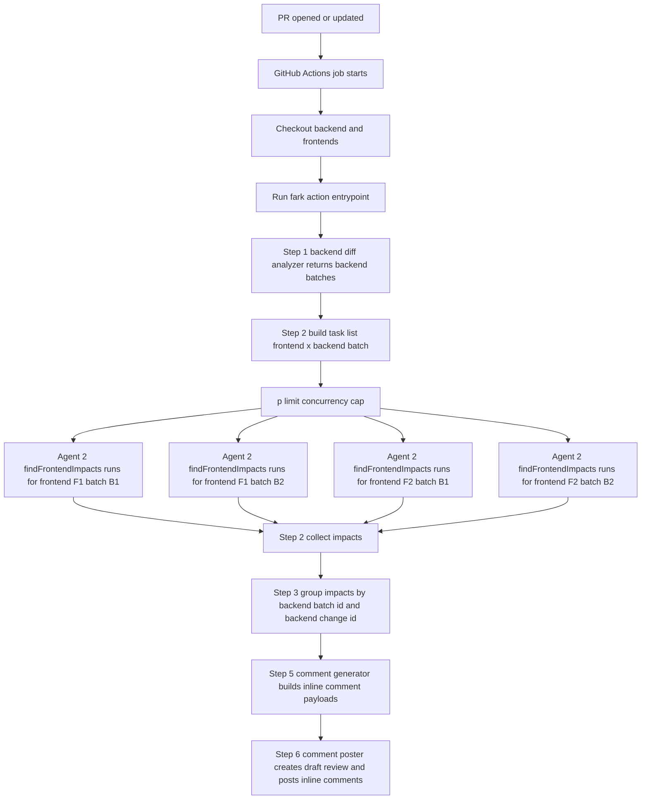

# Architecture & Agents

The `fark.ai` GitHub Action analyzes a backend pull request for breaking API interface changes, scans checked-out frontend repositories for breakages, and then posts inline PR review comments.

## High-level pipeline
This diagram includes the runner side work (checking out the backend and frontends) plus the full action pipeline.

## Entry point + orchestration

The runtime entrypoint is `src/index.ts`. It:

1. Reads action inputs (backend PR target, frontend repos list, `OPENAI_API_KEY`, MCP server URL, optional agent limits).
2. Builds the `OrchestrateInput` object.
3. Calls `runFarkAnalysis()` from `src/workflow/orchestrate.ts`.

`runFarkAnalysis()` runs the pipeline steps in order, with concurrency for the frontend scan step:

- Step 1: `analyzeBackendDiff()` (BE Analyzer)
- Step 2: `findFrontendImpacts()` (Frontend Finder), executed as parallel tasks with a concurrency cap
- Step 3/4: group results by `backendBatchId` then `backendChangeId`
- Step 5: `generatePRComments()` (Comment Generator)
- Step 6: `postPRComments()` (PR Comment Poster)

## Agents (what each one does)

### Agent 1: BE Diff Analyzer (`src/agents/be-analyzer.ts`)

Goal: identify breaking API interface changes by analyzing the backend PR diff.

Prompt instructions (condensed):

- Use GitHub PR read tools as the primary source of truth for what changed in the PR, preferring diff hunks over full file reads.
- Report only breaking API interface changes (REST routes, GraphQL schema, gRPC proto). Ignore internal-only changes unless they impact API surface.
- Do not waste context: only load code sections when diff evidence is insufficient to confirm impact.
- Use `bash` for codebase searching and reading small, bounded sections around matches. Use `readFile` only when `bash` cannot provide what is needed.
- Avoid unnecessary repo listing and avoid git operations (the PR branch is already checked out on disk).
- Parse the diff hunk metadata and emit exact line anchor fields (path, startLine, endLine, startSide, endSide) so later steps can attach inline PR comments reliably.
- Group the detected breaking changes into backend batches so step two can scan frontend code in aligned chunks.

### Agent 2: Frontend Impact Finder (`src/agents/frontend-finder.ts`)

Goal: determine where backend changes will break frontend code.

Prompt instructions (condensed):

- Input is one frontend repo plus one backend batch. It builds a focused set of "essential changes" from that batch (no need for the full diff hunks).
- It must confirm real breakage patterns in actual source code, not just report every match it finds.
- Tool constraints:
  - Use `bash` to search and inspect the repository with small, bounded output.
  - Use `readFile` only as a last resort.
- Search strategy constraints:
  - Search from the repo root and then narrow to obvious source roots.
  - Avoid junk folders like `node_modules`, `.git`, build output folders, and large irrelevant trees.
  - Keep command output small and paginated so the model context does not blow up.
  - Deduplicate the identifiers it searches so it does not repeat the same work.
- Batch completeness rule:
  - It must consider every backend change id in the batch. It should not stop early.
  - Return empty impacts only after checking all changes in this batch and finding no confirmed breakages.

- Output contract:
  - Returns a `frontendImpacts` array where each item includes `backendBatchId`, `backendChangeId`, `frontendRepo`, `file`, `apiElement`, `description`, and `severity`.
  - `frontendRepo` must be formatted as `owner/repo:branch`.
  - `backendBatchId` and `backendChangeId` must match the input batch and the specific change.id.

Where the parallelism happens in code:

- `runFarkAnalysis()` creates one task per `(frontend, backend batch)` pair and runs them with a concurrency cap using `p-limit`.

### Agent 3: PR Comment Generator (`src/agents/comment-generator.ts`)

Goal: turn backend changes + frontend impacts into concrete inline PR review comments.

Prompt instructions (condensed):

- It receives a list of backend changes where each entry already contains `frontendImpacts`.
- For each backend change entry, it selects the most relevant diff hunk(s) from the provided diff hunks.
- It generates inline PR comment bodies anchored to the exact hunk metadata values:
  - path
  - startLine
  - endLine
  - startSide
  - endSide
- It must not recompute or "fix up" anchor line metadata. The output must use the provided values exactly.
- It outputs:
  - a markdown `summary`
  - a `comments` array where each item includes `path`, `startLine`, `endLine`, `startSide`, `endSide`, and the final markdown `body`.
- It generates one inline comment per selected diff hunk:
  - For each change entry in the input `changes` array, it selects the minimal relevant diff hunk(s) to avoid redundant comments.
  - It uses the selected diff hunk line metadata exactly for comment anchoring.
- Frontend impact content rules:
  - If `frontendImpacts` is non-empty for a given change, the comment body includes a Frontend Impact section grouping impacted frontend files by frontend repo.
  - If `frontendImpacts` is empty, that section is omitted for that change.
- If there are no backend changes, it returns `comments: []` and a summary stating no breaking changes were found.

### Agent 4: PR Comment Poster (`src/agents/pr-comment-poster.ts`)

Goal: create a draft review on the backend PR and add the inline comments.

Prompt instructions (condensed):

- Step 1 uses `pull_request_read` once to fetch the PR head SHA, stored as `commitID`.
- Step 2 creates a pending draft review with `pull_request_review_write` using `method="create"`, and it must omit the `event` parameter so GitHub creates a draft reliably.
- Step 2 must handle the case where a pending review already exists by deleting the existing draft review and retrying.
- Step 3 adds inline comments with `add_comment_to_pending_review` for each comment input using:
  - path
  - startLine and line (where `line` corresponds to the endLine)
  - startSide and side (startSide/endSide)
  - body
- Step 3 must attempt to add every comment from the input `comments` array in array order. Each comment must either succeed inline or be included in the top-level failure section.
- If any inline comment add fails, it must not drop that finding. The full comment body and the tool error string must be included in the top-level review body section `## Could not post as inline comments`.
- Step 4 submits the pending review with `pull_request_review_write` using `method="submit_pending"` and `event="COMMENT"`.
- After submitting step four, it returns immediately and does not call any more PR tools.

## Data passing (the "contracts" between steps)

Each agent returns JSON that is validated by Zod schemas inside the agent (orchestrator also validates inputs with Zod). The key rule is:

- The schemas ensure later steps can rely on stable IDs (`batchId`, `change.id`) and stable diff anchor metadata (`path`, `startLine/endLine`, `startSide/endSide`).

