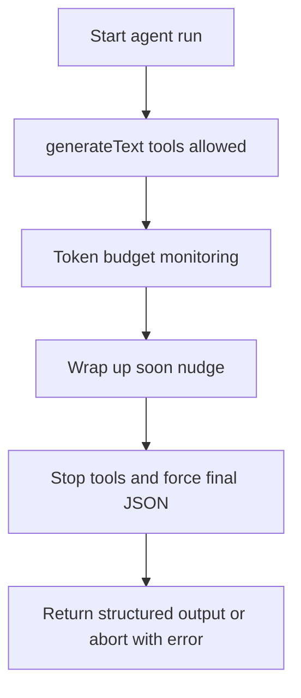
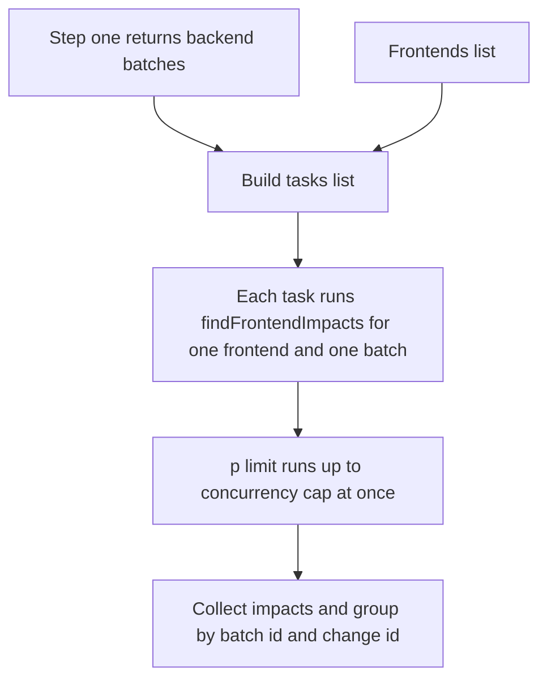

# Speed & Token Strategy

This action is intentionally token-aware. It tries to minimize:

- how much code is read into the model context
- how many tool calls are made
- total steps and total tokens per agent run

## Where limits are applied

Each agent calls `calculateLimits()` (defaults from `src/constants/agent-token-defaults.ts`) and then uses `enforceLimits()` during `generateText()`:

- `stopWhen: stepCountIs(MAX_STEPS)` caps steps
- `maxOutputTokens: MAX_OUTPUT_TOKENS` caps model output size
- `enforceLimits()` watches accumulated tokens and changes behavior:
  - at >= 85% budget: inject a "wrap up soon" nudge (tools still allowed)
  - at >= 100% budget: stop tool usage and force final JSON
  - if usage is critical (>= ~125%): abort with an error
  - at the step-limit boundary: force output generation if no structured output exists yet

## Token enforcement flow

## Parallelization in Step Two

Step two runs the frontend impact finder as multiple tasks. Each task checks a single frontend repo against a single backend batch.

The tasks run in parallel, but `runFarkAnalysis()` enforces a concurrency cap using `p-limit`.

## Speed: batches + parallelization

### Batches

Step 1 (BE Analyzer) returns `batches[]`. These batches group related breaking changes together.

Step 2 (Frontend Finder) runs once per `(frontend, batch)` pair:

- Batching happens here: step one produces `batches[]`, and step two scans one backend batch at a time.
- Each `(frontend, batch)` run corresponds to exactly one call to `findFrontendImpacts`.
- Later, step three groups results by `backendBatchId` and `backendChangeId` so step five can comment per backend change.
- It also avoids re-scanning the whole frontend for every individual backend change inside a batch.

### Parallelization with a concurrency cap

`runFarkAnalysis()` creates one task per `(frontend x backendBatch)` combination, then wraps task execution with `p-limit(concurrencyLimit)`.

The cap is controlled by:

- action input: `frontend_finder_concurrency_limit`
- env fallback: `FRONTEND_FINDER_CONCURRENCY_LIMIT`
- default: `5`

## Speed: limiting data access

The agents’ prompts include strict "data access" constraints so they do not load unnecessary repository data:

- Use PR diff first; only read more when you cannot confirm impact from diff alone.
- Prefer reading small, relevant sections via `bash` (and bounded `sed`/range reads), not whole files.
- Avoid inventory-style directory walking (`find`, repeated `ls`) unless it’s genuinely needed to pick good search roots.
- The filesystem tools mount the codebase read-only via an overlay FS, so the action reads from the checked-out workspace but does not "clone" internally.

